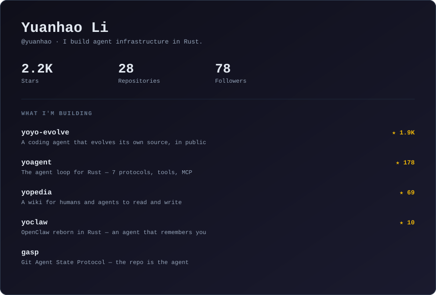

<picture>
  <source media="(prefers-color-scheme: dark)" srcset="assets/card.svg">
  <source media="(prefers-color-scheme: light)" srcset="assets/card-light.svg">
  
</picture>

### What I'm working on

I build the layer underneath coding agents — the loop, the state, the protocol — mostly in Rust,
mostly in public.

- **[yoagent](https://github.com/yologdev/yoagent)** is the runtime: a stateless agent loop, 7 LLM
  wire protocols, tool middleware, sub-agents, MCP and OpenAPI adapters. 456 of its 463 tests run
  with no network and no API keys.
- **[yoyo-evolve](https://github.com/yologdev/yoyo-evolve)** is what happens when you point that
  runtime at itself: a coding agent that rewrites its own source. It started at 200 lines of Rust,
  and every commit since has been agent-written and gated on tests.
- **[GASP](https://github.com/yologdev/gasp)** is the part I think matters longest — a protocol for
  portable agent state, where restoring an agent is just `git clone`. The repo *is* the agent.

Also: [yopedia](https://github.com/yologdev/yopedia), a wiki meant to be read and written by humans
and agents alike, and [yoclaw](https://github.com/yologdev/yoclaw), a single-binary agent that
remembers you.

📍 Germany · 🦀 Rust · 📦 [crates.io/users/yologdev](https://crates.io/users/yologdev)

The card above regenerates weekly from the GitHub API — see
<a href="scripts/gen_card.py">scripts/gen_card.py</a>.
